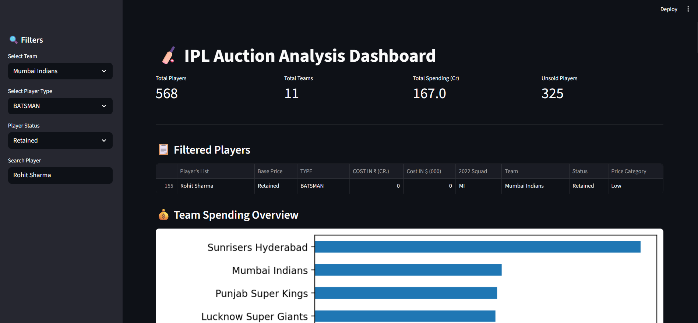

# 🏏 IPL Auction Analysis Dashboard

## 📌 Overview

This project presents an advanced analysis of the IPL 2023 auction dataset using **Python, Pandas, and Streamlit**.
It provides an interactive dashboard to explore player pricing, team spending, and auction trends.

The project combines **data analysis, visualization, and machine learning-ready structure** to simulate real-world analytics workflows.

---

## 🎯 Objectives

* Analyze team-wise spending patterns
* Identify unsold, sold, and retained players correctly
* Understand demand across player roles
* Provide an interactive and user-friendly dashboard
* Generate data-driven insights dynamically

---

## 🛠️ Tech Stack

* **Python**
* **Pandas**
* **Matplotlib**
* **Streamlit**
* **Scikit-learn (for ML extension)**

---

## 📊 Features

### 🔍 Interactive Filters

* Team selection
* Player type selection
* Player status (Sold / Unsold / Retained)
* Search player by name

---

### 📈 Visual Analytics

* Team-wise spending overview
* Spending by player type
* Top 10 most expensive players
* Price category distribution

---

### 📊 KPI Metrics

* Total players
* Total teams
* Total auction spending
* Total unsold players

---

### ❌ Unsold Player Analysis

* Identifies unsold players accurately
* Separates retained players from unsold (data correction applied)

---

### 💡 Price Categorization

Players are categorized into:

* Low
* Medium
* High
* Very High

---

### 🧠 Dynamic Insights

Automatically generated insights such as:

* Highest and lowest spending teams
* Most expensive player type
* Market trends and demand patterns

---

## 🧠 Key Insights

* All-rounders attract the highest spending due to versatility
* A large number of players remain unsold → oversupply in auction pool
* Spending is concentrated among a small group of players
* Teams prioritize multi-role players over specialists

---

## 📂 Project Structure

```
IPL-Data-Analysis/
│
├── app.py                         # Streamlit dashboard
├── ipl_analysis.ipynb             # Exploratory analysis
├── IPL_Squad_2023_Auction_Dataset.csv
├── src/
│   └── model.py                   # ML model (optional extension)
├── requirements.txt
├── .gitignore
└── README.md
```

---

## 🚀 How to Run

```
streamlit run app.py
```

---

## 🔧 Data Improvements

* Converted price column to numeric
* Handled missing values
* Introduced **Status column**:

  * Sold
  * Unsold
  * Retained

---

## 🤖 Machine Learning (Extension)

The project includes a basic ML pipeline to:

* Predict player price based on team and role
* Demonstrate end-to-end data science workflow

---

## 📸 Dashboard Preview

### 🔹 Main Dashboard

---

## 📌 Future Enhancements

* Improve ML model with more features
* Deploy dashboard online (Streamlit Cloud)
* Add multi-season comparison
* Integrate AI-based querying system

---

## 🙌 Author

ARIJIT SEN 

JIS College of Engineering 

Developed as a portfolio project to demonstrate:

* Data analysis
* Visualization
* Dashboard development
* Problem-solving and data cleaning

---
